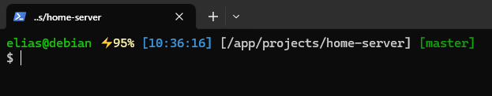

# Personal prompt theme

This is an override of the "candy" theme.

Copy the contents of `custom` folder inside the same folder of the Oh my zsh installation (probably `~/.oh-my-zsh`). Then set variable `ZSH_THEME="candy"` inside `~/.zshrc` file

